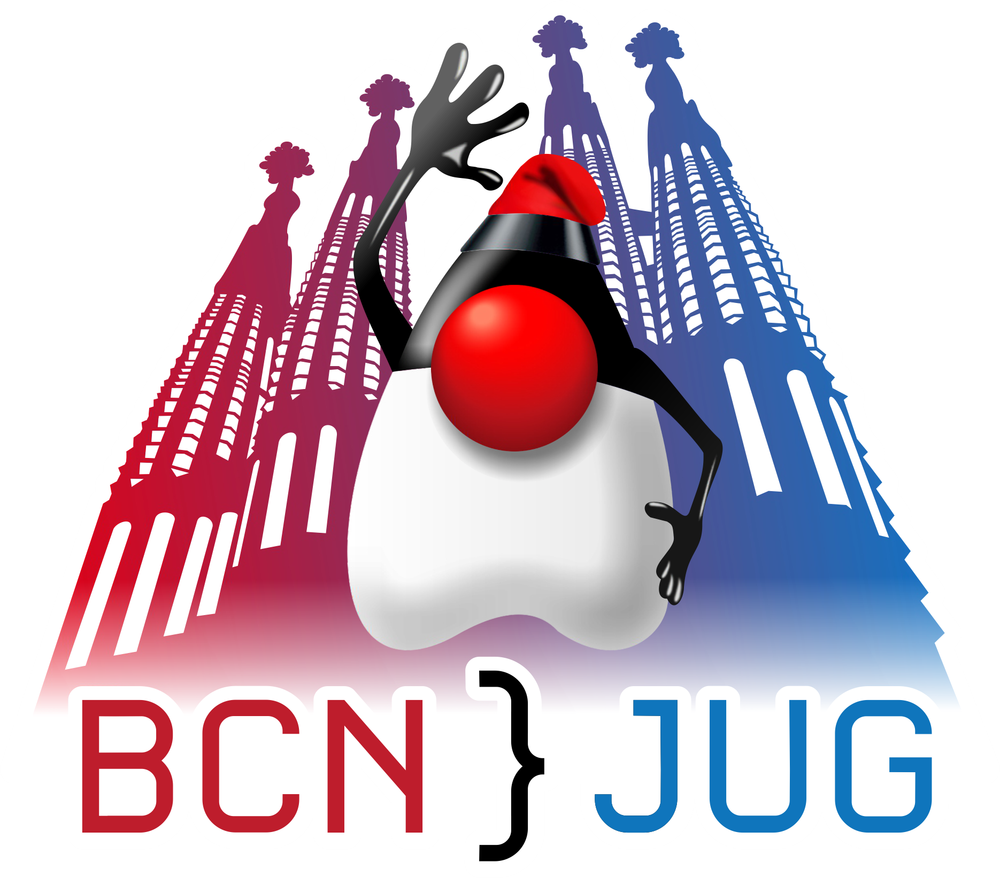

# Workshop: Enhancing Java Applications with Spring AI

## Project Requirements
- [Java](https://sdkman.io/) 21+
- [Maven](https://maven.apache.org/download.cgi) 3.6+
- [Docker](https://www.docker.com/)
- [curl](https://curl.se/) or any other REST client ([Postman](https://www.postman.com/), [HTTPie](https://httpie.io/), [VS code Rest client](https://marketplace.visualstudio.com/items?itemName=humao.rest-client), [Jetbrains Http Client](https://www.jetbrains.com/help/idea/http-client-in-product-code-editor.html))
- An [OpenAI API](https://platform.openai.com/docs/overview) key or [Ollama](https://ollama.com/) installed locally

## Exercise 3—chatbot with RAG

1. Open the `pom.xml` and add the following dependencies:
```xml
<dependencies>    
    <!-- Spring AI RAG dependency - to process PDFs, DOCs, HTMLs -->
    <dependency>
        <groupId>org.springframework.ai</groupId>
        <artifactId>spring-ai-tika-document-reader</artifactId>
    </dependency>
    <!-- Spring AI RAG dependency - to work with PG Vector Database -->
    <dependency>
        <groupId>org.springframework.ai</groupId>
        <artifactId>spring-ai-pgvector-store-spring-boot-starter</artifactId>
    </dependency>
    <!-- Dependency to start-up the PG Vector Database using docker-compose -->
    <dependency>
        <groupId>org.springframework.boot</groupId>
        <artifactId>spring-boot-docker-compose</artifactId>
        <scope>runtime</scope>
    </dependency>
</dependencies>
```
2. Create a `compose.yml` file in the root of the project with the following content:
```yaml
services:
  database:
    image: 'pgvector/pgvector:pg16'
    ports:
      - '5432'
    environment:
      - 'POSTGRES_USER=myuser'
      - 'POSTGRES_DB=mydatabase'
      - 'POSTGRES_PASSWORD=secret'
    labels:
      org.springframework.boot.service-connection: postgres
```
3. Add the following properties inside the `application.properties` file, to create the PG Vector Schema at initialization
   and the Talent Arena websites that will be used during the Ingestion process of the RAG:
```properties
#PostgreSQL vector database properties
spring.ai.vectorstore.pgvector.initialize-schema=true

# Talent Arena properties
talent-arena.websites.workshops=https://talentarena.tech/workshops-agenda/
talent-arena.websites.talks=https://talentarena.tech/talks-agenda/
talent-arena.websites.conference=https://talentarena.tech/conference-agenda/

# Spring Boot docker-compose properties
spring.docker.compose.stop.command=down
spring.docker.compose.skip.in-tests=false
```
4. Create the following Configuration properties classes in the `workshop.springai.config` package:
```java
package workshop.springai.config;

public record Website(String url) {
}
```
```java
package workshop.springai.config;

import org.springframework.boot.context.properties.ConfigurationProperties;

import java.util.Map;

@ConfigurationProperties("talent-arena")
public record TalentArenaProperties(Map<String, Website> websites) {
}
```
5. Add the following annotation `@EnableConfigurationProperties(TalentArenaProperties.class)` to the `TalentArenaApplication` class,
   the final version of the class should look like this:
```java
package workshop.springai;

import org.springframework.boot.SpringApplication;
import org.springframework.boot.autoconfigure.SpringBootApplication;
import org.springframework.boot.context.properties.EnableConfigurationProperties;
import workshop.springai.config.TalentArenaProperties;

@EnableConfigurationProperties({TalentArenaProperties.class})
@SpringBootApplication
public class TalentArenaApplication {

    public static void main(String[] args) {
        SpringApplication.run(TalentArenaApplication.class, args);
    }

}
```

6. Open the `ChatClientConfig` class and add the following bean methods:
```java
    @Bean
    public TextSplitter textSplitter() {
        return new TokenTextSplitter();
    }

    @Bean(name = "chatClientWithRag")
    public ChatClient chatClientWithRag(ChatClient.Builder chatClientBuilder, VectorStore vectorStore) {
        return chatClientBuilder
                .defaultAdvisors(
                        new QuestionAnswerAdvisor(vectorStore),
                        new SimpleLoggerAdvisor())
                .build();
    }
```
7. Create a `IngestionService` class with the following content, to ingest the content of the Talent-Arena websites into the PG Vector Database:
```java
package workshop.springai.rag;

import lombok.extern.slf4j.Slf4j;
import org.springframework.ai.reader.tika.TikaDocumentReader;
import org.springframework.ai.transformer.splitter.TextSplitter;
import org.springframework.ai.vectorstore.VectorStore;
import org.springframework.boot.CommandLineRunner;
import org.springframework.stereotype.Service;
import workshop.springai.config.TalentArenaProperties;

@Slf4j
@Service
public class IngestionService implements CommandLineRunner {

    private final VectorStore vectorStore;
    private final TextSplitter textSplitter;
    private final TalentArenaProperties talentArenaProperties;

    public IngestionService(VectorStore vectorStore, TextSplitter textSplitter,
                            TalentArenaProperties talentArenaProperties) {
        this.vectorStore = vectorStore;
        this.textSplitter = textSplitter;
        this.talentArenaProperties = talentArenaProperties;
    }

    @Override
    public void run(String... args) {
        log.info("Ingesting data for Talent Arena");

        talentArenaProperties.websites().forEach((key, website) -> {
            log.info("Ingesting data for {} with the url {}", key, website.url());
            TikaDocumentReader textReader = new TikaDocumentReader(website.url());
            var documents = textSplitter.apply(textReader.get());
            vectorStore.accept(documents);
        });

        log.info("VectorStore Loaded with data!");
    }
}

```
8. Create a `RagController` class with the following content:
```java
package workshop.springai.rag;

import lombok.extern.slf4j.Slf4j;
import org.springframework.ai.chat.client.ChatClient;
import org.springframework.beans.factory.annotation.Qualifier;
import org.springframework.web.bind.annotation.GetMapping;
import org.springframework.web.bind.annotation.RequestBody;
import org.springframework.web.bind.annotation.RestController;

@Slf4j
@RestController
public class RagController {

    private final ChatClient chatClient;

    public RagController(@Qualifier(value = "chatClientWithRag") ChatClient chatClient) {
        this.chatClient = chatClient;
    }

    @GetMapping(value = "/chat/rag/talent-arena/", produces = "text/plain", consumes = "text/plain")
    public String chat(@RequestBody String message) {
        log.info("Chat Rag with message: {}", message);

        return chatClient.prompt()
                .system("""
                        You are a talent arena assistant.
                        You will only reply queries about this event, and reply in English.
                        Your tone should be enthusiastic and positive.
                        in case you don't know the answer, invite the user to visit the event page https://talentarena.tech.
                        """)
                .user(message)
                .call()
                .content();
    }
}

```
9. Build the project using Maven:
```shell
mvn clean install
```
10. Run the project using Maven:
```shell
mvn spring-boot:run
```
11. Open a new terminal and test the chatbot using curl:
```shell
curl -X GET http://localhost:8080/chat/rag/talent-arena/ -H "Content-Type: text/plain" -d "What are the content related to Artificial Intelligence in Talent Arena 2025 ?"
```
<details>
<summary>Optional - running the Application with Ollama and DeepSeek</summary>

12. Install [Ollama](https://ollama.com/download) in your local machine.

13. Add the following properties inside the `application.properties` file to use Ollama with the DeepSeek model:
```properties
# Properties for the Ollama API
spring.ai.ollama.init.pull-model-strategy=always
spring.ai.ollama.init.embedding.additional-models=mxbai-embed-large
spring.ai.ollama.chat.options.model=deepseek-r1:1.5b
```
14. Change the `pom.xml` to add the new dependency `spring-ai-ollama-spring-boot-starter` in a
    specific maven profile and the `spring-ai-openai-spring-boot-starter` in a default maven profile.

The final version of the `pom.xml` should look like this:
```xml
<?xml version="1.0" encoding="UTF-8"?>
<project xmlns="http://maven.apache.org/POM/4.0.0" xmlns:xsi="http://www.w3.org/2001/XMLSchema-instance"
         xsi:schemaLocation="http://maven.apache.org/POM/4.0.0 https://maven.apache.org/xsd/maven-4.0.0.xsd">
    <modelVersion>4.0.0</modelVersion>
    <parent>
        <groupId>org.springframework.boot</groupId>
        <artifactId>spring-boot-starter-parent</artifactId>
        <version>3.4.3</version>
        <relativePath/> <!-- lookup parent from repository -->
    </parent>
    <groupId>workshop.springai</groupId>
    <artifactId>talent-arena</artifactId>
    <version>0.0.1-SNAPSHOT</version>
    <name>talent-arena</name>
    <description>Demo project for Spring Boot</description>
    <url/>
    <licenses>
        <license/>
    </licenses>
    <developers>
        <developer/>
    </developers>
    <scm>
        <connection/>
        <developerConnection/>
        <tag/>
        <url/>
    </scm>
    <properties>
        <java.version>21</java.version>
        <spring-ai.version>1.0.0-M6</spring-ai.version>
    </properties>
    <dependencies>
        <dependency>
            <groupId>org.springframework.boot</groupId>
            <artifactId>spring-boot-starter-actuator</artifactId>
        </dependency>
        <dependency>
            <groupId>org.springframework.boot</groupId>
            <artifactId>spring-boot-starter-web</artifactId>
        </dependency>

        <dependency>
            <groupId>org.projectlombok</groupId>
            <artifactId>lombok</artifactId>
            <optional>true</optional>
        </dependency>
        <!-- Spring AI RAG dependency - to process PDFs, DOCs, HTMLs -->
        <dependency>
            <groupId>org.springframework.ai</groupId>
            <artifactId>spring-ai-tika-document-reader</artifactId>
        </dependency>
        <!-- Spring AI RAG dependency - to work with PG Vector Database -->
        <dependency>
            <groupId>org.springframework.ai</groupId>
            <artifactId>spring-ai-pgvector-store-spring-boot-starter</artifactId>
        </dependency>
        <!-- Dependency to start-up the PG Vector Database using docker-compose -->
        <dependency>
            <groupId>org.springframework.boot</groupId>
            <artifactId>spring-boot-docker-compose</artifactId>
            <scope>runtime</scope>
        </dependency>
        <dependency>
            <groupId>org.springframework.boot</groupId>
            <artifactId>spring-boot-starter-test</artifactId>
            <scope>test</scope>
        </dependency>
    </dependencies>
    <dependencyManagement>
        <dependencies>
            <dependency>
                <groupId>org.springframework.ai</groupId>
                <artifactId>spring-ai-bom</artifactId>
                <version>${spring-ai.version}</version>
                <type>pom</type>
                <scope>import</scope>
            </dependency>
        </dependencies>
    </dependencyManagement>

    <build>
        <plugins>
            <plugin>
                <groupId>org.apache.maven.plugins</groupId>
                <artifactId>maven-compiler-plugin</artifactId>
                <configuration>
                    <annotationProcessorPaths>
                        <path>
                            <groupId>org.projectlombok</groupId>
                            <artifactId>lombok</artifactId>
                        </path>
                    </annotationProcessorPaths>
                </configuration>
            </plugin>
            <plugin>
                <groupId>org.springframework.boot</groupId>
                <artifactId>spring-boot-maven-plugin</artifactId>
                <configuration>
                    <excludes>
                        <exclude>
                            <groupId>org.projectlombok</groupId>
                            <artifactId>lombok</artifactId>
                        </exclude>
                    </excludes>
                </configuration>
            </plugin>
        </plugins>
    </build>

    <profiles>
        <profile>
            <id>openai</id>
            <activation>
                <activeByDefault>true</activeByDefault>
            </activation>
            <dependencies>
                <dependency>
                    <groupId>org.springframework.ai</groupId>
                    <artifactId>spring-ai-openai-spring-boot-starter</artifactId>
                </dependency>
            </dependencies>
        </profile>

        <profile>
            <id>ollama</id>
            <dependencies>
                <dependency>
                    <groupId>org.springframework.ai</groupId>
                    <artifactId>spring-ai-ollama-spring-boot-starter</artifactId>
                </dependency>
            </dependencies>
        </profile>

    </profiles>

</project>

```
15. Build the project using Maven with the Ollama profile:
```shell
mvn clean install -Pollama
```
16. Run the project using Maven with the Ollama profile:
```shell
mvn spring-boot:run -Pollama
```
17. Open a new terminal and test the chatbot using curl:
```shell
curl -X GET http://localhost:8080/chat/rag/talent-arena/ -H "Content-Type: text/plain" -d "What are the content related to Artificial Intelligence in Talent Arena 2025 ?"
```
</details>
<details>
<summary>Optional - Start the PGVector database with testContainer instead of docker-compose</summary>

18. Open the `pom.xml` and add the following dependencies:
```xml
<dependencies>    
    <!-- TestContainers dependencies -->
    <dependency>
        <groupId>org.springframework.boot</groupId>
        <artifactId>spring-boot-testcontainers</artifactId>
        <scope>test</scope>
    </dependency>
    <dependency>
        <groupId>org.springframework.ai</groupId>
        <artifactId>spring-ai-spring-boot-testcontainers</artifactId>
        <scope>test</scope>
    </dependency>
    <dependency>
        <groupId>org.testcontainers</groupId>
        <artifactId>junit-jupiter</artifactId>
        <scope>test</scope>
    </dependency>
    <dependency>
        <groupId>org.testcontainers</groupId>
        <artifactId>postgresql</artifactId>
        <scope>test</scope>
    </dependency>
</dependencies>
```
19. Create a `TestContainersConfiguration` class with the following content, in the `src/test/java` folder in the `workshop.springai.config` package:
```java
package workshop.springai.config;

import org.springframework.boot.test.context.TestConfiguration;
import org.springframework.boot.testcontainers.service.connection.ServiceConnection;
import org.springframework.context.annotation.Bean;
import org.testcontainers.containers.PostgreSQLContainer;
import org.testcontainers.utility.DockerImageName;

@TestConfiguration(proxyBeanMethods = false)
public class TestContainersConfiguration {

    @Bean
    @ServiceConnection
    PostgreSQLContainer<?> pgvectorContainer() {
        return new PostgreSQLContainer<>(DockerImageName.parse("pgvector/pgvector:pg16"));
    }

}

```

20. Create a `TestTalentArenaApplication` class with the following content, in the `src/test/java` folder in the `workshop.springai` package:
```java
package workshop.springai;

import org.springframework.boot.SpringApplication;
import workshop.springai.config.TestContainersConfiguration;

public class TestTalentArenaApplication {

    public static void main(String[] args) {
        SpringApplication.from(TalentArenaApplication::main)
                .with(TestContainersConfiguration.class)
                .run(args);
    }

}
```
21. Add the following annotation `@Import(TestContainersConfiguration.class)` to the `TalentArenaApplicationTests` class, the final version of the class should look like this:
```java
package workshop.springai;

import org.junit.jupiter.api.Test;
import org.springframework.boot.test.context.SpringBootTest;
import org.springframework.context.annotation.Import;
import workshop.springai.config.TestContainersConfiguration;

@Import(TestContainersConfiguration.class)
@SpringBootTest
class TalentArenaApplicationTests {

    @Test
    void contextLoads() {
    }

}
```

22. Change the value of the `spring.docker.compose.skip.in-tests` property inside the `application.properties` 
file to `true`, with this configuration the docker-compose will not be started during the tests:
```properties
# Spring Boot docker-compose properties
spring.docker.compose.skip.in-tests=true
```

23. Build the project using Maven:
```shell
mvn clean install
```
24. Run the project using Maven, but this time with test-run:
```shell
mvn spring-boot:test-run
```
25. Open a new terminal and test the chatbot using curl:
```shell
curl -X GET http://localhost:8080/chat/rag/talent-arena/ -H "Content-Type: text/plain" -d "What are the content related to Artificial Intelligence in Talent Arena 2025 ?"
```
</details>